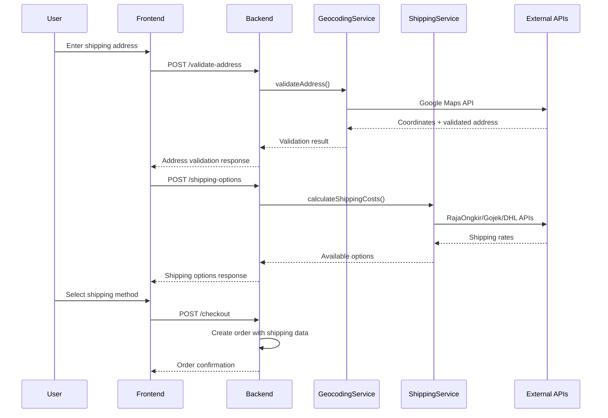
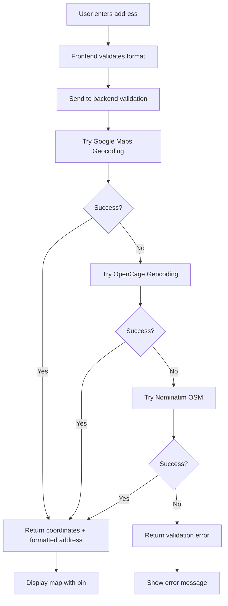
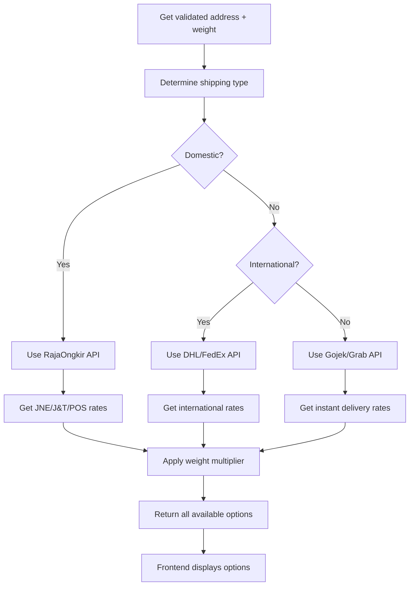

# 🚚 Shipping & Geocoding Integration Guide

## Overview

Integrated shipping and geocoding system that supports:
- **Domestic Shipping**: JNE, J&T, POS Indonesia via RajaOngkir
- **Instant Delivery**: Gojek, Grab for same-day delivery
- **International Shipping**: DHL, FedEx, EMS
- **Geocoding**: Google Maps, OpenCage, Nominatim
- **Interactive Maps**: Static maps and embedded maps

## 🏗️ Architecture Overview

```
┌─────────────────┐    ┌─────────────────┐    ┌─────────────────┐
│   Frontend      │    │   Backend API   │    │  External APIs  │
│                 │    │                 │    │                 │
│ • Address Form  │◄──►│ • OrderController│◄──►│ • RajaOngkir    │
│ • Map Display   │    │ • ShippingService│    │ • Google Maps   │
│ • Cost Calc     │    │ • GeocodingService│   │ • Gojek/Grab    │
│ • Tracking      │    │                 │    │ • DHL/FedEx     │
└─────────────────┘    └─────────────────┘    └─────────────────┘
```

## 🔧 Component Integration

### 1. ShippingService Integration

**File**: `/src/services/shippingService.ts`

**Key Features**:
- Multi-courier support (domestic, instant, international)
- Real-time cost calculation
- Fallback mechanisms
- Weight-based pricing

**Usage Example**:
```typescript
import { ShippingService } from '../services/shippingService';

const shippingOptions = await ShippingService.calculateShippingCosts(
  destinationAddress,
  totalWeight
);
```

### 2. GeocodingService Integration

**File**: `/src/services/geocodingService.ts`

**Key Features**:
- Address validation and geocoding
- Multiple provider fallbacks
- Distance calculation
- Map URL generation

**Usage Example**:
```typescript
import { GeocodingService } from '../services/geocodingService';

const geocodeResult = await GeocodingService.geocodeAddress(address);
const isValid = await GeocodingService.validateAddress(address);
```

### 3. OrderController Integration

**File**: `/src/controllers/orderController.ts`

**Enhanced Checkout Process**:
1. Validate shipping address using GeocodingService
2. Calculate shipping costs using ShippingService
3. Apply selected shipping method and cost
4. Create order with accurate location data

## 🌐 API Endpoints

### Shipping Endpoints

#### 1. Get Shipping Options
```http
POST /api/orders/shipping-options
```

**Request Body**:
```json
{
  "destination": {
    "street": "Jl. Sudirman No. 123",
    "city": "Jakarta",
    "state": "DKI Jakarta",
    "postalCode": "12345",
    "country": "Indonesia"
  },
  "weight": 500,
  "courier": "jne",
  "service": "REG"
}
```

**Response**:
```json
{
  "success": true,
  "data": {
    "domestic": [...],
    "instant": [...],
    "international": [...]
  }
}
```

#### 2. Validate Address
```http
POST /api/orders/validate-address
```

**Request Body**:
```json
{
  "address": "Jl. Sudirman No. 123, Jakarta Pusat, DKI Jakarta 10110"
}
```

**Response**:
```json
{
  "success": true,
  "data": {
    "isValid": true,
    "coordinates": {
      "latitude": -6.2088,
      "longitude": 106.8456
    },
    "address": {
      "street": "Jl. Sudirman No. 123",
      "city": "Jakarta Pusat",
      "state": "DKI Jakarta",
      "postalCode": "10110",
      "country": "Indonesia"
    },
    "mapUrl": "https://maps.google.com/maps?q=-6.2088,106.8456"
  }
}
```

#### 3. Get Delivery Information
```http
POST /api/orders/delivery-info
```

**Response includes**:
- Distance from origin
- Delivery zone
- Estimated delivery time
- Available services

## 🔑 API Configuration

### Required Environment Variables

```env
# Shipping APIs
RAJAONGKIR_API_KEY=your-rajaongkir-api-key
GOJEK_API_KEY=your-gojek-api-key
GRAB_API_KEY=your-grab-api-key
DHL_API_KEY=your-dhl-api-key
FEDEX_API_KEY=your-fedex-api-key

# Geocoding APIs
GOOGLE_MAPS_API_KEY=your-google-maps-api-key
OPENCAGE_API_KEY=your-opencage-api-key

# Default Origin (Your Warehouse)
DEFAULT_ORIGIN_CITY=Jakarta
DEFAULT_ORIGIN_PROVINCE=DKI Jakarta
DEFAULT_ORIGIN_LATITUDE=-6.2088
DEFAULT_ORIGIN_LONGITUDE=106.8456
```

### API Key Setup Guide

#### 1. RajaOngkir (Domestic Shipping)
1. Register at [rajaongkir.com](https://rajaongkir.com)
2. Choose Starter plan (free) or Pro plan
3. Get API key from dashboard
4. Add to `.env`: `RAJAONGKIR_API_KEY=your_key`

#### 2. Google Maps (Geocoding)
1. Go to [Google Cloud Console](https://console.cloud.google.com)
2. Enable Geocoding API and Maps JavaScript API
3. Create API key with restrictions
4. Add to `.env`: `GOOGLE_MAPS_API_KEY=your_key`

#### 3. OpenCage (Fallback Geocoding)
1. Register at [opencagedata.com](https://opencagedata.com)
2. Get free API key (2500 requests/day)
3. Add to `.env`: `OPENCAGE_API_KEY=your_key`

## 🔄 Integration Flow

### 1. Checkout Process Flow



### 2. Address Validation Flow



### 3. Shipping Cost Calculation Flow



## 🎯 Frontend Integration

### 1. Address Input Component

```javascript
// Address validation on input
const validateAddress = async (address) => {
  try {
    const response = await fetch('/api/orders/validate-address', {
      method: 'POST',
      headers: {
        'Content-Type': 'application/json',
        'Authorization': `Bearer ${token}`
      },
      body: JSON.stringify({ address })
    });
    
    const result = await response.json();
    
    if (result.success && result.data.isValid) {
      // Show map with pin
      displayMap(result.data.coordinates, result.data.mapUrl);
      return result.data.address;
    } else {
      // Show error
      showAddressError('Alamat tidak valid');
    }
  } catch (error) {
    console.error('Address validation error:', error);
  }
};
```

### 2. Shipping Options Component

```javascript
// Get shipping options
const getShippingOptions = async (destination, weight) => {
  try {
    const response = await fetch('/api/orders/shipping-options', {
      method: 'POST',
      headers: {
        'Content-Type': 'application/json',
        'Authorization': `Bearer ${token}`
      },
      body: JSON.stringify({ destination, weight })
    });
    
    const result = await response.json();
    
    if (result.success) {
      // Display shipping options
      displayShippingOptions(result.data);
    }
  } catch (error) {
    console.error('Shipping options error:', error);
  }
};
```

### 3. Map Display Component

```javascript
// Display interactive map
const displayMap = (coordinates, mapUrl) => {
  // Option 1: Static map
  const staticMapUrl = `https://maps.googleapis.com/maps/api/staticmap?center=${coordinates.latitude},${coordinates.longitude}&zoom=15&size=400x300&markers=${coordinates.latitude},${coordinates.longitude}&key=${GOOGLE_MAPS_API_KEY}`;
  
  // Option 2: Embedded interactive map
  const embedUrl = `https://www.google.com/maps/embed/v1/place?key=${GOOGLE_MAPS_API_KEY}&q=${coordinates.latitude},${coordinates.longitude}`;
  
  // Update map container
  document.getElementById('map-container').innerHTML = `
    <iframe src="${embedUrl}" width="100%" height="300" frameborder="0"></iframe>
  `;
};
```

## 🔍 Testing & Debugging

### 1. Test Address Validation

```bash
curl -X POST http://localhost:3000/api/orders/validate-address \
  -H "Content-Type: application/json" \
  -H "Authorization: Bearer YOUR_TOKEN" \
  -d '{
    "address": "Jl. Sudirman No. 123, Jakarta Pusat, DKI Jakarta 10110"
  }'
```

### 2. Test Shipping Options

```bash
curl -X POST http://localhost:3000/api/orders/shipping-options \
  -H "Content-Type: application/json" \
  -H "Authorization: Bearer YOUR_TOKEN" \
  -d '{
    "destination": {
      "street": "Jl. Sudirman No. 123",
      "city": "Jakarta",
      "state": "DKI Jakarta",
      "postalCode": "12345",
      "country": "Indonesia"
    },
    "weight": 500
  }'
```

### 3. Debug Logs

Check logs for integration issues:
```bash
# View shipping service logs
grep "ShippingService" logs/app.log

# View geocoding service logs
grep "GeocodingService" logs/app.log

# View API errors
grep "ERROR" logs/app.log | grep -E "(RajaOngkir|GoogleMaps|OpenCage)"
```

## 🚨 Error Handling

### 1. API Fallback Strategy

```typescript
// Geocoding fallback
try {
  result = await googleMapsGeocode(address);
} catch (error) {
  try {
    result = await openCageGeocode(address);
  } catch (error) {
    result = await nominatimGeocode(address);
  }
}
```

### 2. Shipping Cost Fallback

```typescript
// If external API fails, use default rates
if (!externalApiResult) {
  return {
    courier: 'standard',
    service: 'regular',
    cost: calculateDefaultShippingCost(weight, distance),
    etd: '3-5 hari',
    description: 'Estimasi pengiriman standar'
  };
}
```

## 📊 Performance Optimization

### 1. Caching Strategy

- **Address validation**: Cache for 24 hours
- **Shipping rates**: Cache for 1 hour
- **Geocoding results**: Cache for 7 days

### 2. Rate Limiting

- **RajaOngkir**: 1000 requests/month (Starter)
- **Google Maps**: $200 free credit/month
- **OpenCage**: 2500 requests/day (Free)

### 3. Batch Processing

```typescript
// Batch multiple shipping calculations
const batchShippingCalculation = async (destinations: Address[]) => {
  const promises = destinations.map(dest => 
    ShippingService.calculateShippingCosts(dest, weight)
  );
  
  return await Promise.allSettled(promises);
};
```

## 🔒 Security Considerations

### 1. API Key Protection

- Store API keys in environment variables
- Use different keys for development/production
- Implement API key rotation
- Monitor API usage

### 2. Input Validation

```typescript
// Validate address input
const validateAddressInput = (address: string): boolean => {
  // Check for malicious input
  const maliciousPatterns = [/<script>/i, /javascript:/i, /on\w+=/i];
  return !maliciousPatterns.some(pattern => pattern.test(address));
};
```

### 3. Rate Limiting

```typescript
// Implement rate limiting for shipping endpoints
const shippingRateLimit = rateLimit({
  windowMs: 15 * 60 * 1000, // 15 minutes
  max: 100, // limit each IP to 100 requests per windowMs
  message: 'Too many shipping requests, please try again later'
});
```

## 🎯 Best Practices

### 1. Error Messages

```typescript
const ERROR_MESSAGES = {
  INVALID_ADDRESS: 'Alamat tidak valid atau tidak ditemukan',
  SHIPPING_UNAVAILABLE: 'Layanan pengiriman tidak tersedia untuk alamat ini',
  API_ERROR: 'Terjadi kesalahan sistem, silakan coba lagi',
  WEIGHT_EXCEEDED: 'Berat paket melebihi batas maksimum'
};
```

### 2. User Experience

- Show loading states during API calls
- Provide clear error messages
- Display estimated delivery times
- Show shipping cost breakdown
- Enable address autocomplete

### 3. Monitoring

```typescript
// Log important events
logger.info('Shipping calculation', {
  destination: destination.city,
  weight,
  courier,
  cost: result.cost,
  duration: Date.now() - startTime
});
```

## 🔄 Future Enhancements

### 1. Real-time Tracking

- Integrate with courier tracking APIs
- Provide real-time delivery updates
- Send push notifications

### 2. Smart Routing

- Optimize delivery routes
- Suggest nearest pickup points
- Calculate carbon footprint

### 3. Advanced Features

- Scheduled delivery
- Delivery time slots
- Special handling options
- Insurance options

---

**Note**: Pastikan semua API keys sudah dikonfigurasi dengan benar sebelum menggunakan fitur shipping dan geocoding. Untuk testing, Anda bisa menggunakan API keys gratis dari masing-masing provider.